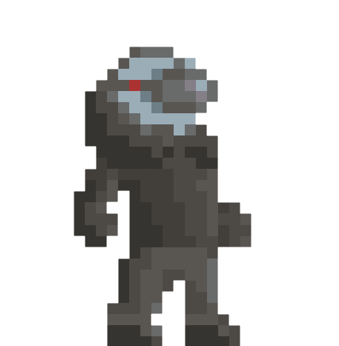

**Dart Goblin** - is a student made singleplayer physics based 2D puzzle platformer, where the player will have to solve various puzzles and platforming challenges by interacting with different physics objects, some simple (basic spheres, cubes), others more unorthodox (spheres unaffected by gravity, exploding crystals, etc.). The player will manipulate these objects by kicking them, launching the object in the direction the player is facing.

In addition to kicking, the player also possesses the ability to instantly swap places with any physics object in direct line of sight. Combining these two mechanics, as well as the unique characteristics and gimmicks of different physics objects, the player will overcome everything from precise object positioning puzzles to platforming challenges that engage the player’s spatial awareness and timing by combining traditional platforming with instantaneous teleporting movement.

## Controls

| Input | Action |
|-------|--------|
| **A** / **D** | Move left/right |
| **Space** | Jump |
| **Mouse** | Look around (cursor shows direction) |
| **Left Click** | Kick object toward cursor |
| **Right Click** | Swap with object (when looking at a swappable object) |
| **W + Right Click** | Perform small jump after teleporting |
| **R** | Reset current room |
| **C + Mouse** | Move camera to scout the room |
| **Esc** | Pause game |
